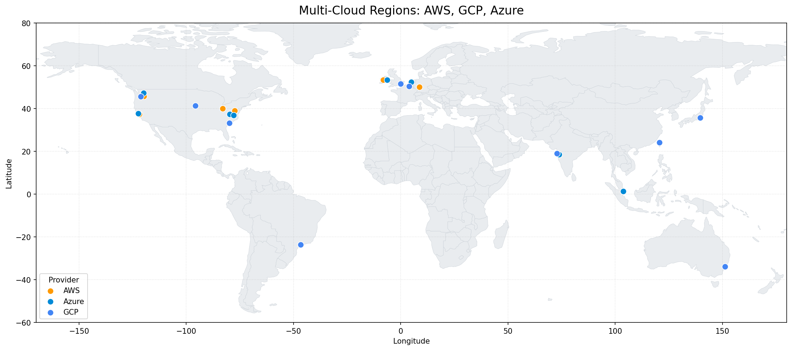

# Multi-Cloud Region Geospatial Analysis



A small, runnable geospatial pipeline that maps and analyzes cloud provider
regions across AWS, GCP, and Azure. Built as an engineering work sample, not a
point and click map exercise. Every spatial question is answered twice: once in
Python with GeoPandas, and once in the database with PostGIS, so the code shows
both where spatial work happens at small scale and where it belongs at large
scale.

## Why this project

The questions it answers are real questions a cloud team asks:

* Which region is closest to a given customer, and how far?
* How far is every region from every other region? (a stand in for cross region
  replication latency)
* How many regions cover a major demand center within a chosen radius?
* Where is each provider's center of mass, and how wide is its footprint?

## What is in the box

```
multicloud_geo_analysis/
  data/
    cloud_regions.csv        raw input: provider, region, lat, long
  src/
    load_regions.py          ingest, validate, build a GeoPackage
    spatial_analysis.py      the four analyses, geodesic distances in km
    postgis_loader.py        push to PostGIS with a spatial index
    export_maps.py           PyQGIS script: auto styled PNG map, no clicking
    make_static_map.py       matplotlib world map, the no QGIS path
  sql/
    schema.sql               PostGIS table and GIST index by hand
    spatial_queries.sql      the same analyses as index assisted SQL
  requirements.txt
```

## How to run

```bash
pip install -r requirements.txt

# 1. Build the GeoPackage from the raw CSV
python src/load_regions.py

# 2. Run the analysis (defaults to a San Diego customer)
python src/spatial_analysis.py --customer-lat 32.72 --customer-lon -117.16
```

Optional database half:

```bash
export PGHOST=localhost PGDATABASE=geo PGUSER=postgres PGPASSWORD=secret
python src/postgis_loader.py
psql -d geo -f sql/spatial_queries.sql
```

Optional map export (needs QGIS installed):

```bash
# Inside the QGIS Python console, or via the standalone PyQGIS launcher
python src/export_maps.py
```

## Sample output

Running step 2 against a San Diego customer:

```
Nearest region to (32.72, -117.16): us-west-1 [AWS] at 674.8 km

Coverage within 2000 km:
     city  regions_within_radius closest_region  closest_km
San Diego                      5      us-west-1       674.8
   London                      6   europe-west2         0.0
Singapore                      2 ap-southeast-1         0.0
Sao Paulo                      3      sa-east-1         0.0

Provider spread:
provider  region_count  centroid_lat  centroid_lon  max_spread_km
     AWS            10        29.826       -13.190        12517.6
   Azure            10        29.695       -13.072        12510.5
     GCP            10        24.343        14.435        15722.2
```

## What each piece is meant to show

* **load_regions.py**: clean ingestion, input validation that fails loud, and
  correct handling of a coordinate reference system (EPSG:4326).
* **spatial_analysis.py**: true geodesic distance on the WGS84 ellipsoid using
  pyproj, not flat planar math that breaks at global scale. Nearest neighbor,
  pairwise matrices, radius coverage, and per group centroids.
* **postgis_loader.py** and the SQL: spatial work pushed into an indexed
  database, KNN with the `<->` operator, `ST_DWithin` for radius search, and a
  GIST index so queries do not scan every row.
* **export_maps.py**: QGIS used as automation through PyQGIS. Loads a layer,
  applies a categorized renderer, and writes a finished PNG with no manual
  steps.

## Skills this demonstrates

Python data engineering, GeoPandas and Shapely, pyproj and coordinate systems,
PostGIS and spatial indexing, PyQGIS automation, and clean reproducible project
structure.

## Honest notes

The region coordinates are approximate, at city level. Cloud providers do not
publish exact data center coordinates, so these are well known location
approximations (us-east-1 near Ashburn, eu-west-1 near Dublin, and so on). That
is fine for distance and proximity analysis, where city level accuracy is
plenty. It would not be fine for anything claiming meter level precision, and
the code does not claim that.

If someone asks, the truthful one line version of this project is: "a
reproducible multi-cloud region proximity pipeline in Python, GeoPandas, and
PostGIS, with QGIS used for automated map export." That is the level it
actually is.
